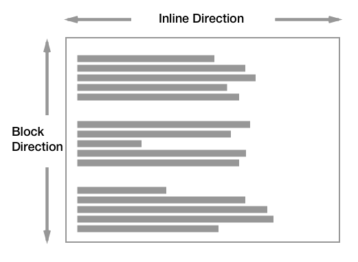

# Box Model

### Types of Boxes

There are two types of boxes: block boxes and inline boxes.

**Block boxes**

It fills the vailable inline space of the parent element containing it and grows along the block dimension to accommodate its content.

**Inline boxes**

It just fit the size of its content.&#x20;

You **can't** set the `width` or `height`, they just sit inside the content of block level elements. If you want to control the size of an inline element in this manner, you need to set it to behave like a block level element (`display: inline-block`)


Every box have an **inner** and an **outer** display type.


### Outer Display

**Outer Display of Block Boxes**

* A block box will break onto a new line.
* The `width` and `height` properties are respected.
* `padding`, `margin` and `border` will cause other elemnts to be pushed away from the box.
* The box will extend in the inline direction to fill the space available in its container.

**Outer Display of Inline Boxes**

* The box will **not** break onto a new line.
* The `width` and `height` properties will **not** apply.
* Vertical `padding`, `margin` and `border` will apply but will **not** cause other inline boxes to move away from the box, and will cause overflow to the parent box.
* Horizontal `padding`, `margin` and `border` will apply and cause other inline boxes to move away from the box, and will **not** cause overflow to the parent box.

### Inner Display of Boxes

Dictates how elements inside that box are laid out.

Most used inner displays are: `flex` and `grid`

### Combining Inner and Outter Displays

`display: flex` for outter = block and inner = flex

`display: inline-flex` for outer = inline and inner= flex

<figure><figcaption></figcaption></figure>

 

<figure><figcaption></figcaption></figure>

