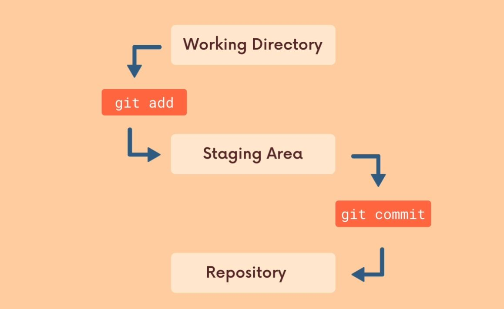

# Git Basics

### Version control

Git is a version control software. It tracks and manages changes to files over time, and allow to:&#x20;

* Revisit earlier versions of the files.
* Compare changes between versions.
* Undo changes and rever previuos versions.
* Collaborate on share changes.
* Combine changes.

### Configuring Git User

<mark style="color:red;">`git config`</mark>` ```` `<mark style="color:orange;">`user.name`</mark> : Show actual user name.

<mark style="color:red;">`git config`</mark>` ```` `<mark style="color:orange;">`user.email`</mark> : Show actual user email.

<mark style="color:red;">`git config`</mark>` ```` `<mark style="color:purple;">`--global`</mark>` `<mark style="color:orange;">`user.name "UserName"`</mark> : Set user name.

<mark style="color:red;">`git config`</mark>` ```` `<mark style="color:purple;">`--global`</mark>` ```` `<mark style="color:orange;">`user.email "email@email.com"`</mark> : Set user email.

### Ignoring Files `.gitignore`

Files you never want to commit:

* Secrets, API Keys, credentials, etc.
* Operating System Files (.DS\_Store)
* Log files (because you can regenerate the easily)
* Dependencies & packages (you can import them whenever you want)

```bash
# You can prepend a pattern with a double asterisk to match directories anywhere in the repository.
**/logs

# An asterisk is a wildcard that matches zero or more characters.
*.log

# Appending a slash indicates the pattern is a directory. The entire contents of any directory in the repository matching that name – including all of its files and subdirectories – will be ignored
logs/
```

### First Commands


A Git _"repo"_ is a workspace wich tracks and manage files within a folder.


#### Initialize a repository

<mark style="color:red;">`git init`</mark> : Initialize a get repo in the current directory.

#### Get information of a repository

<mark style="color:red;">`git status`</mark> : Gives info on the current status of a git repo and its content.

<mark style="color:red;">`git log`</mark> : A log of the commits for a given repo.

<mark style="color:red;">`git log`</mark>` `<mark style="color:purple;">`--oneline`</mark> : A resuming log of the commits for a given repo.

### Basic Git Workflow




A _commit_ is a checkpoint in a repo. It takes a snapshot of your project in that moment.


<mark style="color:red;">`git add`</mark>` ```` `<mark style="color:orange;">`<file1> <file2>`</mark>` ``...` : Add file(s) to the staging area.

<mark style="color:red;">`git add .`</mark> : Add all changes to the staging area.

<mark style="color:red;">`git commit`</mark>` ```` `<mark style="color:purple;">`-m`</mark>` ```` `<mark style="color:orange;">`"A short message"`</mark> : Commit changes from the staging area.


**TIP: Atomic Commits**

Try to keep each commit focused on a single thing (_feature, change, fix_). This makes it much easier to undo or rollback changes later on.

It also makes your project easier to be reviewed.


#### Discard changes in staging area

<mark style="color:red;">`git restore`</mark>` `<mark style="color:orange;">`<file>`</mark> : Discard changes in working directory

<mark style="color:red;">`git restore`</mark>` ```` `<mark style="color:purple;">`--staged`</mark>` ```` `<mark style="color:orange;">`<file>`</mark> : Unstage file(s)

<mark style="color:red;">`git rm`</mark>` ```` `<mark style="color:purple;">`-cached`</mark>` ```` `<mark style="color:orange;">`<file>`</mark> : Unstage file(s)

#### Amending Commits

```bash
# How to redo the previous commit

> git commit -m "a random message"
> git add forgotten_file
> git commit --amend
```

### Branches

The default branch name in Git is `master`. In GitHub is `main`.

HEAD is simply a pointer that refers to the current location in your repository. It points to the reference of the lastest commit you made in a branch.

#### Create branches

<mark style="color:red;">`git branch`</mark> : to view existing branches.

<mark style="color:red;">`git branch`</mark>` ```` `<mark style="color:orange;">`<name>`</mark> : Make a new branch based upon the current HEAD.

<mark style="color:red;">`git branch`</mark>` ```` `<mark style="color:orange;">`<new-branch> <commit-hash>`</mark> : Make a new branch from \<commit-hash>.

#### Switch between branches

<mark style="color:red;">`git switch`</mark>` ```` `<mark style="color:orange;">`<branch>`</mark> : Switch HEAD to a existing branch.

<mark style="color:red;">`git switch`</mark>` ```` `<mark style="color:purple;">`-c`</mark>` ```` `<mark style="color:orange;">`<new-branch>`</mark> : Create a new branch and switch it.

#### Switching branches with unstaged changes

If yours unstaged changes have conflicts with other branches, you only can:

* commit changes, or
* stash changes

Else, if yours unstaged changes don't have conflicts with other branches, you can switch branches and still preserve yours unstaged changes.

**Alternative commands for switch branches**

<mark style="color:red;">`git checkout`</mark>` ```` `<mark style="color:orange;">`<branch>`</mark> : (Old) Switch HEAD to a existing branch.

<mark style="color:red;">`git checkout`</mark>` ```` `<mark style="color:purple;">`-b`</mark>` ```` `<mark style="color:orange;">`<new-branch>`</mark> : (Old) Create a new branch and switch it.

#### Delete branches


HEAD cannot reference the branch you want to remove.


<mark style="color:red;">`git branch`</mark>` ```` `<mark style="color:purple;">`-d`</mark>` ```` `<mark style="color:orange;">`<branch>`</mark> : Only remove an existing branch if it is fully merged.

<mark style="color:red;">`git branch`</mark>` ```` `<mark style="color:purple;">`-D`</mark>` ```` `<mark style="color:orange;">`<branch>`</mark> : Force to delete an existing branch, even it is not fully merged.

#### Rename branches

<mark style="color:red;">`git branch`</mark>` ```` `<mark style="color:purple;">`-m`</mark>` ```` `<mark style="color:orange;">`<new-branch-name>`</mark> : Rename the current branch.

#### Merging branches


We merge branches, not specific commits.



We always merge to the current HEAD branch.


```bash
# Fast Forward Merge the bugfix branch into master

> git switch master
> git merge bugfix
```

### Diff

It is useful to view changes between commits, branches, files.


<mark style="color:red;">`git diff`</mark> : List changes between Working directory and stagging area.

<mark style="color:red;">`git diff`</mark>` ```` `<mark style="color:purple;">`--staged`</mark> : List changes between stagging area and last commit (HEAD)

<mark style="color:red;">`git diff`</mark>` ```` `<mark style="color:green;">`HEAD`</mark> : List all changes in the working tree (WD and SA) since your last commit


**`git diff --cached`**: It is an alias for _git diff --staged_


#### Diff specific files

<mark style="color:red;">`git diff`</mark>` `<mark style="color:orange;">`<filename1>`</mark>` `<mark style="color:red;">``</mark>` ``...` : Working directory <--> stagging area.

<mark style="color:red;">`git diff`</mark>` ```` `<mark style="color:purple;">`--staged`</mark>` `<mark style="color:orange;">`<filename1>`</mark>` `<mark style="color:purple;">``</mark>` ``...` : stagging area <--> last commit (HEAD)

<mark style="color:red;">`git diff`</mark>` ```` `<mark style="color:green;">`HEAD`</mark>` `<mark style="color:orange;">`<filename1>`</mark>` ``...` : working tree (WD and SA) <--> last commit

#### Comparing branches and commits

<mark style="color:red;">`git diff`</mark>` `<mark style="color:orange;">`<branch1>`</mark>`..`<mark style="color:orange;">`<branch2>`</mark> : Diff all the files

<mark style="color:red;">`git diff`</mark>` `<mark style="color:orange;">`<commit-hash1>`</mark>`..`<mark style="color:orange;">`<commit-hash2>`</mark> : Diff all the files.

### Git Stash (reserva)

Helps you to save changes tant you are not ready to commit. Running git stash takes all uncommited changes (SA and WA) and stash them, reverting the changes in your WD.

<mark style="color:red;">`git stash`</mark> : Stash uncommited changes.

<mark style="color:red;">`git stash`</mark>` ```` `<mark style="color:purple;">`pop`</mark> : Remove last "stash" from stack and apply it to your WD (wherever you are).

<mark style="color:red;">`git stash`</mark>` ```` `<mark style="color:purple;">`list`</mark> : List of stashes.


Stashes are store in Stack (LIFO)


#### Work with multiple stashes

<mark style="color:red;">`git stash`</mark>` `<mark style="color:purple;">`apply`</mark> : Apply last "stash", without removing it from stash Stack. This is useful for apply stashed changes to multiple branches.

<mark style="color:red;">`git stash`</mark>` ```` `<mark style="color:purple;">`apply`</mark>` ```` `<mark style="color:orange;">`stash@{2}`</mark> : Apply stash@{2} to your WD. Its not removed from the Stack

<mark style="color:red;">`git stash`</mark>` ```` `<mark style="color:purple;">`drop`</mark>` ```` `<mark style="color:orange;">`stash@{2}`</mark> : Remove custom stash from stack.

<mark style="color:red;">`git stash`</mark>` ```` `<mark style="color:purple;">`clear`</mark> : Clear stash stack.


### Git Checkout

The command git checkout is overloaded. You can use checkout to:

* Create new branches (Alias: git switch -c \<branch>)
* Switch branches (Alias: git switch \<branch>)
* Restore files (Alias: git restore \<filename>)
* **Travel to a particular commit**
* Discard changes

<mark style="color:red;">`git checkout`</mark>` `<mark style="color:orange;">`<commit-hash>`</mark> : <mark style="color:red;">**\[DETACHED HEAD]**</mark> Travel to a particular commit.&#x20;

<mark style="color:red;">`git checkout`</mark>` `<mark style="color:green;">`HEAD~1`</mark> : <mark style="color:red;">**\[DETACHED HEAD]**</mark> Travel to the last commit before HEAD (parent).

<mark style="color:red;">`git switch -`</mark> : Re-atach HEAD pointer to current branch.


**Detached HEAD state:**

In detached HEAD state you can look around, make experimental changes and discard any commits you make in this state without impacting any branches by switching back to a branch.


#### Restore changes

<mark style="color:red;">`git restore`</mark>` `<mark style="color:orange;">`<filename1>`</mark>` ``...` : Restore the filename snapshot in the last commit.

<mark style="color:red;">`git restore`</mark>` `<mark style="color:purple;">`--source`</mark>` `<mark style="color:red;">``</mark>` `<mark style="color:green;">`HEAD~1`</mark><mark style="color:orange;">`<filename1>`</mark>` ``...` : Restore filename snapshot in HEAD\~1

<mark style="color:red;">`git restore`</mark>` `<mark style="color:purple;">`--source`</mark>` `<mark style="color:red;">``</mark>` `<mark style="color:green;">`<commit-hash>`</mark>` `<mark style="color:orange;">`<filename1>`</mark>` ``...` : Alias from previous command.


**Aliases for **_**git restore**_**:**

<mark style="color:red;">`git checkout`</mark>` ```` `<mark style="color:green;">`HEAD`</mark>` ```` `<mark style="color:orange;">`<filename1>`</mark>` ``...`

<mark style="color:red;">`git checkout`</mark>` ```` `<mark style="color:green;">`--`</mark>` ```` `<mark style="color:orange;">`<filename1>`</mark>` ``...`


#### Unstage changes

<mark style="color:red;">`git restore`</mark>` `<mark style="color:purple;">`--staged`</mark><mark style="color:orange;">`<filename1>`</mark>` ``...` : Unstage file(s).

### Git Reset&#x20;

\[For SOLO Projects] Undo commits changing the historic commits log.&#x20;

#### Soft Reset

<mark style="color:red;">`git reset`</mark>` ```` `<mark style="color:orange;">`<commit-hash>`</mark> : <mark style="color:red;">**\[UNDOABLE]**</mark> Reset the repo back to a specific commit and changes remain in your working directory. It is useful when you commit in a wrong branch.

#### Hard Reset

<mark style="color:red;">`git reset`</mark>` ```` `<mark style="color:purple;">`--hard`</mark>` ```` `<mark style="color:orange;">`<commit-hash>`</mark> : <mark style="color:red;">**\[UNDOABLE]**</mark> Delete al commits and associate changes.

<mark style="color:red;">`git reset`</mark>` ```` `<mark style="color:purple;">`--hard`</mark>` ```` `<mark style="color:green;">`HEAD~1`</mark> : <mark style="color:red;">**\[UNDOABLE]**</mark> Alias for previous command.


**Git reset** delete commits and moves the branch pointer backwards. **Git revert** instead creates a brand new commit reversing the changes from a commit.

For _collaborative and remote projects_ you must use **git revert** because changing history can produce errors.


### Git Revert

\[For collaborative projects] Make a brand new commit with a former commit.

<mark style="color:red;">`git revert`</mark>` ```` `<mark style="color:orange;">`<commit-hash>`</mark> : Revert \<commit-hash>

