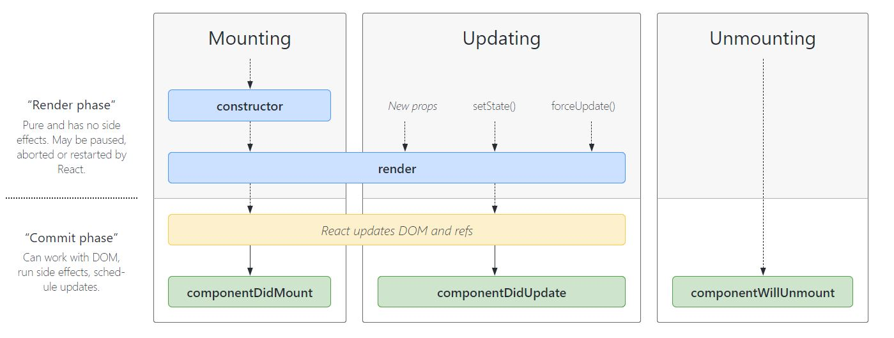

# React Component LifeCycle





### componentDidMount

```
componentDidMount()
```

`componentDidMount()` is invoked immediately after a component is mounted (inserted into the tree). Initialization that requires DOM nodes should go here. If you need to load data from a remote endpoint, this is a good place to instantiate the network request.

This method is a good place to set up any subscriptions. If you do that, don’t forget to unsubscribe in `componentWillUnmount()`.

You **may call `setState()` immediately** in `componentDidMount()`. It will trigger an extra rendering, but it will happen before the browser updates the screen. This guarantees that even though the `render()` will be called twice in this case, the user won’t see the intermediate state. Use this pattern with caution because it often causes performance issues. In most cases, you should be able to assign the initial state in the `constructor()` instead. It can, however, be necessary for cases like modals and tooltips when you need to measure a DOM node before rendering something that depends on its size or position.

***

### componentDidUpdate <a href="#componentdidupdate" id="componentdidupdate"></a>

```
componentDidUpdate(prevProps, prevState, snapshot)
```

`componentDidUpdate()` is invoked immediately after updating occurs. This method is not called for the initial render.

Use this as an opportunity to operate on the DOM when the component has been updated. This is also a good place to do network requests as long as you compare the current props to previous props (e.g. a network request may not be necessary if the props have not changed).

```
componentDidUpdate(prevProps) {
  // Typical usage (don't forget to compare props):
  if (this.props.userID !== prevProps.userID) {
    this.fetchData(this.props.userID);
  }
}
```

You **may call `setState()` immediately** in `componentDidUpdate()` but note that **it must be wrapped in a condition** like in the example above, or you’ll cause an infinite loop. It would also cause an extra re-rendering which, while not visible to the user, can affect the component performance. If you’re trying to “mirror” some state to a prop coming from above, consider using the prop directly instead. Read more about [why copying props into state causes bugs](https://reactjs.org/blog/2018/06/07/you-probably-dont-need-derived-state.html).

If your component implements the `getSnapshotBeforeUpdate()` lifecycle (which is rare), the value it returns will be passed as a third “snapshot” parameter to `componentDidUpdate()`. Otherwise this parameter will be undefined.

> Note
>
> `componentDidUpdate()` will not be invoked if [`shouldComponentUpdate()`](https://reactjs.org/docs/react-component.html#shouldcomponentupdate) returns false.

***

### componentWillUnmount <a href="#componentwillunmount" id="componentwillunmount"></a>

```
componentWillUnmount()
```

`componentWillUnmount()` is invoked immediately before a component is unmounted and destroyed. Perform any necessary cleanup in this method, such as invalidating timers, canceling network requests, or cleaning up any subscriptions that were created in `componentDidMount()`.

You **should not call `setState()`** in `componentWillUnmount()` because the component will never be re-rendered. Once a component instance is unmounted, it will never be mounted again.
